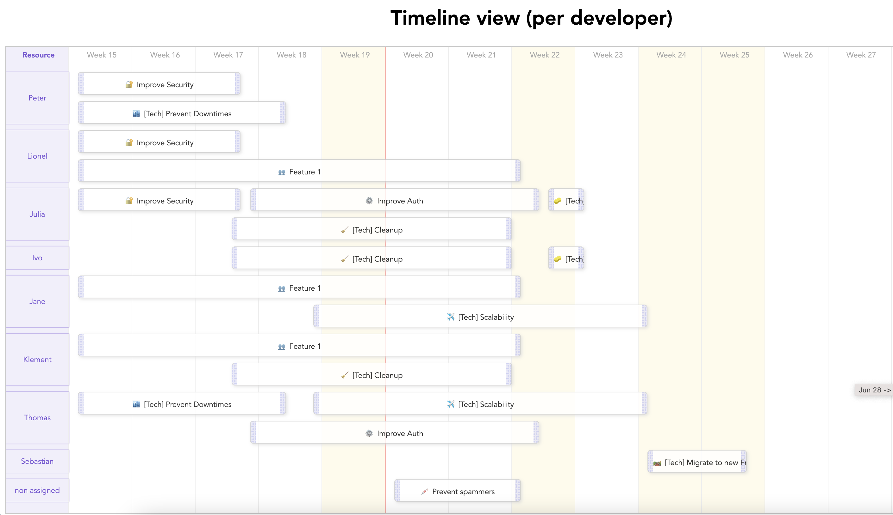

# README

Timeline-Vue is a capacity planner component for VueJS.
Focusing on a single quarter, week or day.
With swimlanes, one for every resource of your team.
With the possibility to select a single item.
With the possibility to highlight a timeline slot (week, day or hour).
With integrated drag & drop (alters the event startDate and endDate accordingly).
Builds upon a simple list of items, with four simple properties.



## Use

```js
import TimelineView from "@nilleb/timeline-vue";
[..]
export default {
  name: "App",
  components: {
    TimelineView,
  },
  data: function() {
      return { 
          events: [
              {
                  name: 'event',
                  startDate: "Mon April 19th, 2021",
                  endDate: "Fri April 23rd, 2021",
                  members: ["Julia", "John"]
              }
        ],
        attributeName: 'members'
    };
  }
}
```

```html
<timeline-view
    :period="'Quarter'"
    :events="events"
    :attributeName="attributeName"
/>
```

## Contribute

To serve the component in local.

```sh
yarn serve
```

To build the minified version of the package.

```sh
yarn build
```
